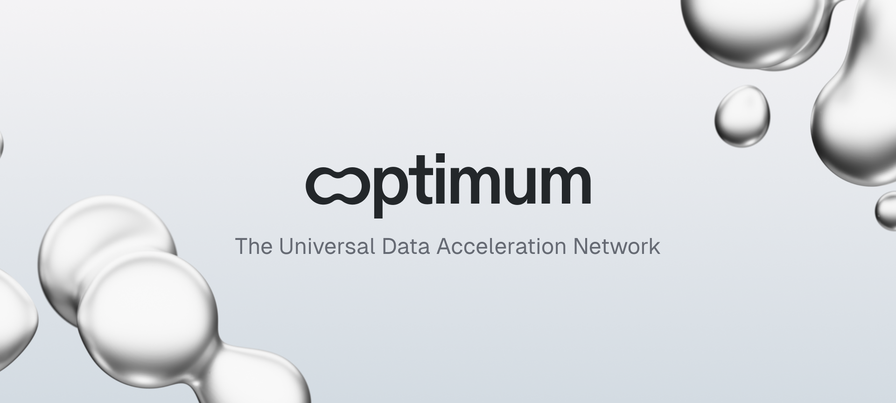

<div align="center">

[](https://github.com/getoptimum/optimum-hop/actions/workflows/docs.yml)
[](https://getoptimum.github.io/optimum-hop/)

[](https://hub.docker.com/r/getoptimum/gateway)
[](https://hub.docker.com/r/getoptimum/gateway)
[](https://vitepress.dev/)
[](./LICENSE)

# Optimum HOP — The fastest way to experience Optimum

</div>

HOP is a **Docker Compose framework** and **test suite** for running Optimum Gateway and monitoring in a few commands.  
It’s the quickest way to experiment with **mump2p** without manual setup.

> **Security:** see [`SECURITY.md`](SECURITY.md) for how to report vulnerabilities.



---

## Integrations

* Ethereum — see [./integration/README.md](./integration/README.md)

## Docs site (this repository)

```bash
yarn install --frozen-lockfile
make run-dev    # VitePress dev server; use make build for production build
```

## Contributing

Contributions are welcome — see [`CONTRIBUTING.md`](CONTRIBUTING.md) and our
[`CODE_OF_CONDUCT.md`](CODE_OF_CONDUCT.md).

## License

This project is licensed under the [GNU General Public License v3.0](LICENSE).
